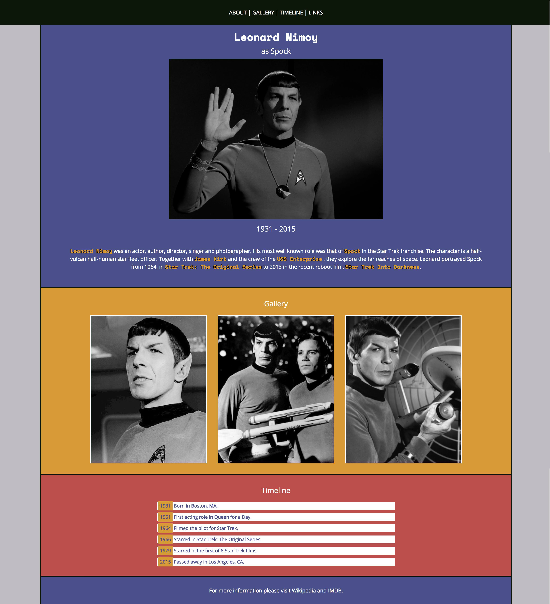
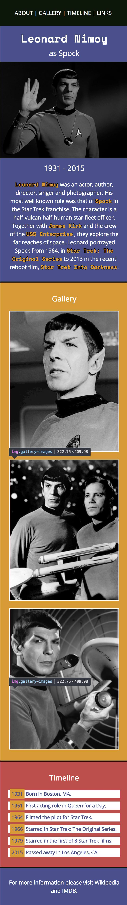

# Website Mockup

Recreate the website based on the mockup and the included images.

Try to match the mockup as best as you can.

Feel free to clone this GitHub repository and build your website in this directory.

Think mobile-first to make your website responsive.

**Bonus:** Make the navigation links clickable. (Hint: Use the `id` attribute.)

Resources:

- [Image Color Picker](https://imagecolorpicker.com/en/)
- [MDN - \<a>: The Anchor element](https://developer.mozilla.org/en-US/docs/Web/HTML/Element/a)

## Desktop Mockup

## Mobile Mockup

